<div align="center">

```
                    .-^^^^^^-.
                 .-'  .--.    `-.
               .'   .'    `.      `.
              /    /  .--.  \       \
             /    |  (o  o)  |       |
            |      \   __   /        |
            |   .-._`-.__.-'_.-.     |
             \  |  `--.  .--'  |    /
              `.|   .  \/  .   |_.'
                |   |\  /\  /| |
                |   | \/  \/ | |
                |   |  ____  | |
             ___|   | / __ \ | |___
         .-''   |   | |  | | | |   ``-.
       .'       |   | |__|_| | |       `.
      /   .--.  |   |  ____  | |  .--.   \
     /   /    \ |   | / __ \ | | /    \   \
    |   |  /\  ||   || |  | || ||  /\  |   |
    |   |  ||  ||   || |__| || ||  ||  |   |
     \   \_||_/ /   / \____/ \ \ \_||_/   /
      `-._    _/   /___.--.__\ \_    _.-'
          `--'     /  /    \  \ `--'
                  /__/      \__\
                _/  /  /\    \  \_
               /___/__/  \____\___\
              /____/  \__/  \_____\
```

```
███████╗███████╗██████╗  ██████╗ ███████╗
╚══███╔╝██╔════╝██╔══██╗██╔════╝ ██╔════╝
  ███╔╝ █████╗  ██████╔╝██║  ███╗█████╗
 ███╔╝  ██╔══╝  ██╔══██╗██║   ██║██╔══╝
███████╗███████╗██║  ██║╚██████╔╝███████╗
╚══════╝╚══════╝╚═╝  ╚═╝ ╚═════╝ ╚══════╝
        FOR CLAUDE CODE
```

# Swarm Rush

**Spawn. Bite. Die. Repeat.**

*A disposable agent orchestration system for parallel task execution*

[](LICENSE)
[](https://python.org)
[](https://claude.ai)
[]()

[]()
[]()
[]()

</div>

---

## Overview

Traditional AI agents are **long-lived**, **context-heavy**, and **slow**.

Swarm Rush agents are **disposable**, **low-context**, and **fast**.

> 💡 Think of it like a hive: thousands of simple workers, each doing one small task, dying quickly, replaced instantly.

### The Problem

| Traditional Agents | Swarm Agents |
|-------------------|--------------|
| Long-running sessions | 4-minute TTL |
| Accumulate context | Fresh each spawn |
| One agent, many tasks | One agent, one task |
| Slow, careful | Fast, disposable |
| Failure = restart everything | Failure = respawn one worker |

### Core Philosophy

```
┌─────────────────────────────────────────┐
│  SPAWN  →  BITE  →  DIE  →  REPEAT     │
└─────────────────────────────────────────┘
```

1. **Short-lived workers** — Agents complete exactly one task, then terminate
2. **Hard time limits** — 4-minute TTL enforced, no exceptions
3. **Small code deltas** — Maximum 100 new lines per task
4. **Low context by design** — Workers only see what they need
5. **Partial work is expected** — Optimized for throughput, not completeness

### Agent Roles

| Role | Symbol | Purpose |
|------|--------|---------|
| **Overlord** | 👁️ | Decomposes tasks, coordinates waves, merges results |
| **Worker** | 🐝 | Executes one microtask, reports result, dies |
| **Queen** | 👑 | (Optional) Refactors and stabilizes after rush |
| **Spine** | 🛡️ | (Optional) QA validation, files bug tasks |

---

## Architecture

### Project Structure

```mermaid
graph TD
    subgraph SWARM["📁 SWARM/"]
        STATE["STATE.json"]
        RULES["SWARM_RULES.md"]
        GATES["GATES.md"]
        PROMPTS["PROMPTS.md"]

        subgraph TASKS["📁 TASKS/"]
            KERNEL["🔥 KERNEL/"]
            ML["🧠 ML/"]
            QUANT["📊 QUANT/"]
            DEX["💱 DEX/"]
            INT["🔗 INTEGRATION/"]
        end

        subgraph IO["📁 I/O"]
            INBOX["📥 INBOX/"]
            OUTBOX["📤 OUTBOX/"]
        end

        TEMPLATES["📁 TEMPLATES/"]
        SCRIPTS["📁 SCRIPTS/"]
        LOCKS["🔒 LOCKS/"]
    end

    STATE --> TASKS
    TASKS --> IO
```



### Wave Execution Flow

```mermaid
sequenceDiagram
    participant O as 👁️ Overlord
    participant T as 📋 Task Queue
    participant W1 as 🐝 Worker 1
    participant W2 as 🐝 Worker 2
    participant W3 as 🐝 Worker 3
    participant I as 📥 Inbox

    O->>T: Decompose goal into microtasks
    O->>T: Compose wave (5 tasks)

    par Parallel Execution
        T->>W1: Assign K001
        T->>W2: Assign K002
        T->>W3: Assign K003
    end

    W1->>I: DONE ✓
    W2->>I: PARTIAL ⚠️
    W3->>I: DONE ✓

    Note over W1,W3: Workers terminate after reporting

    I->>O: Collect results
    O->>T: Create follow-up for PARTIAL
    O->>O: Next wave...
```



### Worker Lifecycle


---

## Quick Start

### Prerequisites

- Python 3.10+
- Claude Code CLI

### Installation

```bash
git clone https://github.com/yourusername/swarm-rush.git
cd swarm-rush
```

### Your First Wave

```bash
# Check swarm status
python SWARM/SCRIPTS/swarm.py status

# View pending tasks
python SWARM/SCRIPTS/swarm.py tasks
```

---

## Usage

### 1. Compose a Wave

Select 5 tasks following the wave template:

| Slot | Type | Example |
|------|------|---------|
| 1 | Implementation | `ADD_PURE_FN` |
| 2 | Implementation | `ADD_STUB` |
| 3 | Validation | `ADD_TEST` |
| 4 | Validation | `ADD_ASSERTS` |
| 5 | Quality | `ADD_BENCH` |

### 2. Spawn Workers

Open 5 Claude Code sessions. In each, paste:

```
You are WORKER-N. Complete exactly ONE task and STOP.
TTL: 4 minutes | Max: 100 lines | Files: 2 max
```

### 3. Collect Results

```bash
python SWARM/SCRIPTS/swarm.py collect
```

### 4. Repeat

```
┌──────────────────────────────────────┐
│  Wave 1  →  Wave 2  →  Wave 3  → ... │
│   5 tasks    5 tasks    5 tasks      │
└──────────────────────────────────────┘
```

---

## Lanes

Workers operate in **isolated lanes** to minimize context and prevent cross-domain contamination.

| Lane | Domain | Keywords |
|------|--------|----------|
| 🔥 `KERNEL` | CUDA, Triton, CUTLASS, GPU ops | `gpu`, `kernel`, `triton` |
| 🧠 `ML` | Models, training, data pipelines | `model`, `train`, `loss` |
| 📊 `QUANT` | Strategy, backtests, signals | `backtest`, `sharpe`, `signal` |
| 💱 `DEX` | Solana, Jupiter, transactions | `solana`, `swap`, `tx` |
| 🔗 `INTEGRATION` | Glue, CLI, wiring only | `cli`, `config`, `wire` |

### Lane Rules

```
┌────────────────────────────────────────────┐
│  ✓ One lane per task                       │
│  ✓ Single-lane waves are fastest           │
│  ✓ Mixed waves: max 3+2 across 2 lanes     │
│  ✗ Never more than 2 lanes per wave        │
│  ✗ Never cross lanes within a task         │
└────────────────────────────────────────────┘
```

---

## Hard Constraints

Every worker obeys these **non-negotiable** limits:

| Constraint | Limit | Enforced By |
|------------|-------|-------------|
| ⏱️ **Timebox** | 4 minutes | Worker prompt |
| 📏 **Max Lines** | 100 new lines | Self-check |
| 📁 **Max Files** | 2 (2nd for tests only) | Task card |
| 📦 **Dependencies** | None new | Worker prompt |
| 🏗️ **Architecture** | No decisions | OVERLORD only |
| 🔍 **Exploration** | Touch list only | BLOCKED if needed |

### What Happens When Limits Hit

```
Time runs out     →  Return PARTIAL + progress notes
Lines exceeded    →  Return PARTIAL + split suggestion
Need more files   →  Return BLOCKED + file list
Can't proceed     →  Return BLOCKED + blocker description
```

---

## Task Types

| Type | Description | Typical Output |
|------|-------------|----------------|
| `ADD_STUB` | Skeleton + TODOs | Class outline |
| `ADD_PURE_FN` | One function + doc | Single function |
| `ADD_TEST` | 1-3 test cases | Test file |
| `FIX_ONE_BUG` | Single bug fix | Minimal change |
| `ADD_ASSERTS` | Runtime checks | Guard statements |
| `ADD_METRIC` | Metric + logging | Metric code |
| `ADD_BENCH` | Benchmark snippet | Timing code |
| `DOC_SNIPPET` | Documentation | README section |
| `REFACTOR_TINY` | Rename/move | No behavior change |

---

## Gates

Each lane has **acceptance criteria** that must pass before marking DONE:

| Lane | Gate Checks |
|------|-------------|
| 🔥 KERNEL | Correctness (CPU match) + Benchmark (1 shape) |
| 🧠 ML | Tests pass OR smoke-run + No import breaks |
| 📊 QUANT | Deterministic output + No NaNs/lookahead |
| 💱 DEX | Dry-run TX builds + Safety checks pass |
| 🔗 INTEGRATION | Wire test + CLI --help works |

---

## CLI Reference

```bash
# Swarm management
python SWARM/SCRIPTS/swarm.py status    # Show wave, counts
python SWARM/SCRIPTS/swarm.py wave      # Increment wave
python SWARM/SCRIPTS/swarm.py tasks     # List OUTBOX
python SWARM/SCRIPTS/swarm.py results   # List INBOX
python SWARM/SCRIPTS/swarm.py collect   # Process INBOX → STATE
```

---

## File Reference

| File | Purpose |
|------|---------|
| `STATE.json` | Wave counter, task status |
| `SWARM_RULES.md` | Master rules document |
| `GATES.md` | Lane acceptance criteria |
| `PROMPTS.md` | Copy-paste role prompts |
| `RUNBOOK.md` | Operational playbook |

---

## Contributing

```
┌─────────────────────────────────────┐
│  1. Pick a task from TASKS/         │
│  2. Create lock in LOCKS/           │
│  3. Implement (≤100 lines, 4 min)   │
│  4. Write result (DONE/PARTIAL)     │
│  5. Remove lock                     │
└─────────────────────────────────────┘
```

**Want to add features?** Open an issue first. We'll decompose it into swarm-safe microtasks.

---

## Philosophy

> *"Quality is not in the individual worker, but in the rhythm of the swarm."*

This system favors:

- **Speed** over elegance
- **Throughput** over completeness
- **Iteration** over perfection
- **Many small wins** over one big push

---

<div align="center">

**Built with 🐝 by disposable agents**

*Spawn fast. Bite hard. Die clean.*

[](https://claude.ai)

</div>
